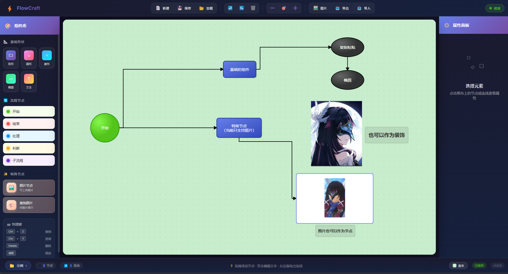

# FlowCraft - 本地使用的流程图创作应用

<p align="center">
  
</p>
<p align="center">
  
  
  
  
</p>

一款基于 Vue 3 + LogicFlow 打造的流程图创作工具，如果你有使用外部工具不想掏钱，不想注册信息，对自己的流程图有保密需求，那么这款基于logicflow库的流程图工具你不妨一试，而且你也可以在此基础上自行进行个性化设计~。

## ✨ 项目初心
不想掏钱，又在意信息泄露风险，自己日常用足够，点击即用，没网也能用，完全本地化。就这样...顺便搞了点护眼特色吧。

## 🎯 核心特性

### 🎨 精心设计的视觉体验
- **暗色主题** - 现代感十足的深色界面，长时间使用不疲劳
- **护眼画布** - 提供杏仁黄、绿豆沙、极光灰等多种护眼背景色
- **美化节点** - 告别单调，每个节点都经过精心设计

### 🛠 强大的编辑能力-日常够用，组件化设计还可以二次甚至多次开发
- **多种节点类型** - 矩形、圆形、菱形、椭圆、文本、图片节点
- **样式自由定制** - 颜色、透明度、字体大小、字体颜色随心调整
- **节点注释** - 为节点添加详细说明，悬停即可查看
- **拖拽缩放** - 节点尺寸可自由调整

### 💾 贴心的作品管理
- **自动保存** - 创作过程自动保存，告别意外丢失
- **多作品管理** - 轻松管理多个流程图作品
- **启动恢复** - 下次打开自动恢复上次的工作状态

### 📤 灵活的导出方式
- **透明背景导出** - PNG 透明背景，方便后期处理
- **JSON 导入导出** - 完整保存作品数据，随时迁移

## 🚀 快速开始

```bash
# 克隆项目
安装依赖.bat
构建.bat
启动.bat

上面走完一遍后，后续启动只需要
启动.bat
即可

或者你也可以试试npm的启动方式
问ai吧，我懒的手打了。
```

打开浏览器访问 `http://localhost:5173`（注意你的终端的地址，以你终端信息为准）

## 📦 技术栈

| 技术 | 说明 |
|------|------|
| Vue 3 | 渐进式 JavaScript 框架 |
| Vite | 下一代前端构建工具 |
| LogicFlow | 专注于业务流程图的可视化框架 |
| LocalStorage | 本地数据持久化 |

## 🖼 界面预览

### 创作界面
- 左侧：节点面板，拖拽添加节点
- 中间：画布区域，自由创作
- 右侧：属性面板，精细调整

### 功能亮点
- 🎯 拖拽添加节点
- ✏️ 双击编辑文本
- 🔗 从边缘拖出连线
- 🖼 支持图片节点
- 📝 节点注释功能
- 🎨 画布颜色自定义

## 📁 项目结构

```
src/
├── components/          # 组件
│   ├── Toolbar.vue      # 工具栏
│   ├── NodePanel.vue    # 节点面板
│   ├── PropertyPanel.vue # 属性面板
│   ├── ProjectManager.vue # 作品管理
│   └── ...
├── nodes/               # 自定义节点
│   ├── StyledNodes.js   # 美化节点
│   └── ImageNode.js     # 图片节点
├── App.vue              # 主应用
└── main.js              # 入口文件
```

## 🤝 贡献

欢迎提交 Issue 和 Pull Request！

## 📄 License

[MIT License](LICENSE)

---

<p align="center">
  让创作更本地
</p>
